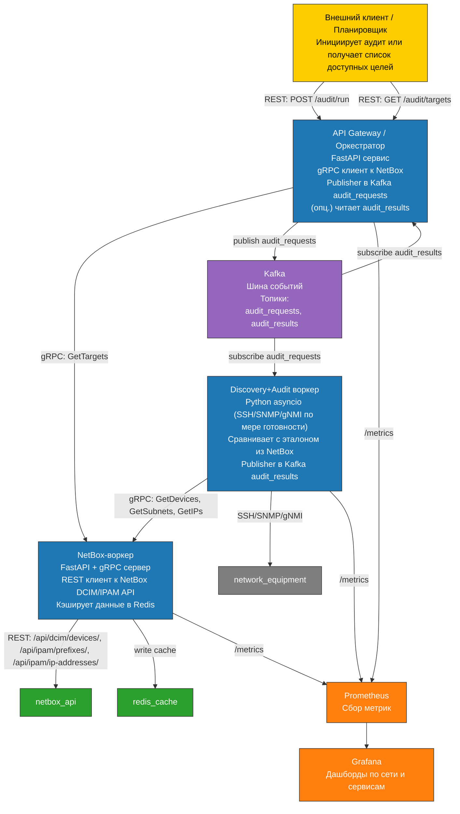

# 🕵️‍♂️ Audit Platform

Микросервисная платформа для сетевого аудита,c мониторингом и анализом инфраструктуры. Включает интеграцию с NetBox, Kafka, gRPC и экспортом метрик через Prometheus и доступом к Grafana.

---

## 📦 Структура репозитория

```
.
├── ApiGateway       # FastAPI шлюз с REST и gRPC клиентами
├── Audit            # Воркеры аудита (Kafka consumer, NetBox discovery)
├── NetBox           # gRPC-обёртка над NetBox API
├── deployment       # Docker Compose + Prometheus + конфиги
└── .gitignore
```
---

## 🧠 Возможности

- REST и gRPC доступ к данным NetBox
- Kafka consumer/producer воркеры
- Обнаружение новых устройств и подсетей
- Экспорт метрик FastAPI в Prometheus

---
## 🏗 Архитектура



## 🛠 Зависимости

- Python 3.13
- Docker + Docker Compose
- Poetry (для локальной разработки)
- Cloudsmith Token (для приватных пакетов)

---
---

## 📍 Автор

**Aleksandr Yurlov**  
GitHub: [@AlexYrlv](https://github.com/AlexYrlv)

---

## 📜 License

MIT License

